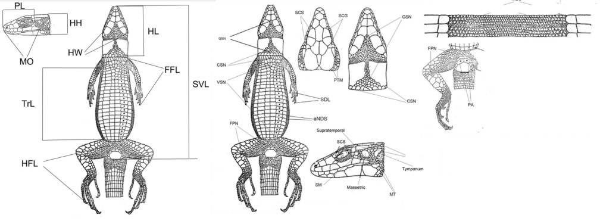

## Introducción

Muchas especies animales estrechamente relacionadas son difíciles de distinguir entre sí por su apariencia externa. A veces se pueden encontrar "características clave", a menudo los biólogos deben depender de conjuntos de características medibles.

Para resolver problemas de esta tipo existen datasets. Uno de estos particularmente es conjunto de datos reales que contiene las medidas de 446 lagartijas de 6 especies (1, 2, 3, 6, 7, 8) pertenecientes al género Darevskia. Las medidas consisten en el recuento de escamas en diferentes partes del cuerpo de las lagartijas (características de la folidosis, distribución de escamas dentro de la cabeza) y tamaños lineales de las partes del cuerpo de las lagartijas (características morfométricas). 

## Descripción de los datos

Para cada lagartija, se proporciona la especie biológica codificada numéricamente y el sexo.
El archivo `csv` contiene las siguientes columnas:

- **Species_num**: especie codificada numéricamente
- **Sex_num**: sexo codificado numéricamente, 1=macho, 2=hembra.
- **Sex**: sexo codificado con letras, M=macho, F=hembra.
- Todas las demás columnas son características de las lagartijas y se describen a continuación:

### Características de la folidosis (recuento de escamas)
1. **MBS**: escamas corporales medianas, número de escamas dorsales, aproximadamente a la mitad del tronco.
2. **VSN**: número de escamas ventrales en la línea media.
3. **CSN**: número de escamas del cuello.
4. **GSN**: número de escamas gulares desde el ángulo entre las escamas maxilares hasta el cuello.
5. **FPN**: número de poros femorales (FPNr – FPN en el lado derecho).
6. **SDL**: láminas subdigitales en el cuarto dedo de la extremidad anterior (SDLr – SDL en la extremidad anterior derecha).
7. **SCS**: número de escamas superciliares (SCSr – SCS en el lado derecho).
8. **SCG**: número de gránulos superciliares (SCGr – SCG en el lado derecho).
9. **SM**: número de escamas entre el escudo masetero y la escama supratemporal (SMr – SM en el lado derecho).
10. **MT**: número de escamas entre los escudos masetero y timpánico en el lado derecho (MTr – MT en el lado derecho).
11. **PA**: número de escamas preanales.
12. **PTM**: número de escamas postemporales (PTMr – PTM en el lado derecho).
13. **aNDS**: número promedio de escamas dorsales a lo largo de una escama abdominal cerca de la extremidad

### Características morfométricas (todas las longitudes en milímetros):
14. **SVL**: longitud desde la punta del hocico hasta la cloaca.
15. **TRL**: longitud del tronco (desde la ingle hasta la axila).
16. **HL**: longitud de la cabeza, medida ventralmente desde la punta del hocico hasta el margen posterior del cuello.
17. **PL**: longitud del pileus medida dorsalmente desde la punta del hocico hasta el margen posterior de las escamas parietales + occipitales.
18. **ESD**: longitud de la mitad posterior del pileus, medida desde el margen anterior de la tercera escama supraocular hasta el margen posterior de las escamas parietales + occipitales.
19. **HW**: ancho de la cabeza antes del agujero timpánico.
20. **HH**: altura de la cabeza cerca de la placa occipital.
21. **MO**: apertura bucal, medida lateralmente desde la punta del hocico hasta el final de la boca.
22. **FFL**: longitud total de la extremidad anterior, desde la base hasta la punta del dedo más largo.
23. **HFL**: longitud total de la extremidad posterior, desde la base hasta la punta del dedo más largo.

{width=700 height=420}

## Objetivos generales
Se requieren criterios que permitan predecir la especie biológica y el sexo de las lagartijas con la mayor precisión posible sobre la base de tales medidas. Estos criterios deben ser relativamente simples y evidentes, es decir, que puedan ser calculados de manera realista por un biólogo en condiciones de campo para permitir a los biólogos construir teorías explicativas.
