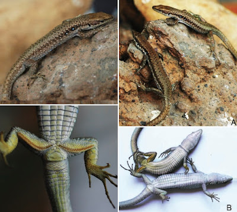
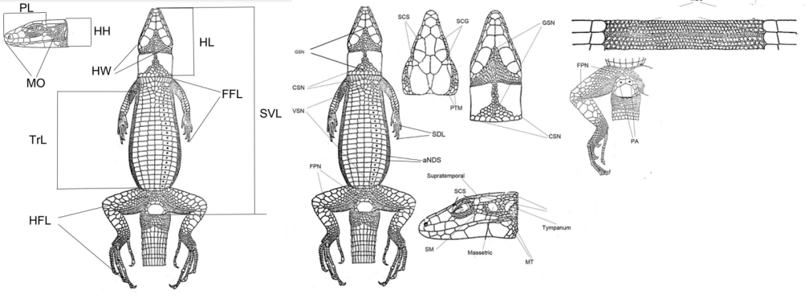

## Introducción

Muchas especies animales estrechamente relacionadas son difíciles de distinguir entre sí por su apariencia externa. A veces se pueden encontrar "características clave", a menudo los biólogos deben depender de conjuntos de características medibles.

Para resolver problemas de esta tipo existen datasets. Uno de estos particularmente es conjunto de datos reales que contiene las medidas de 446 lagartijas de 6 especies (1, 2, 3, 6, 7, 8) pertenecientes al género Darevskia. Las medidas consisten en el recuento de escamas en diferentes partes del cuerpo de las lagartijas (características de la folidosis, distribución de escamas dentro de la cabeza) y tamaños lineales de las partes del cuerpo de las lagartijas (características morfométricas). 



### Carga de paquetes y dataset
```{r message=FALSE, warning=FALSE}
library(dplyr)
library(ggplot2)
library(ggpubr)

species_data <- read.csv("data/Mammoth-2020_Problem.csv", header=TRUE)
```

## Descripción de los datos

Para cada lagartija, se proporciona la especie biológica codificada numéricamente y el sexo.
El archivo `csv` contiene las siguientes columnas:

- **Species_num**: especie codificada numéricamente
- **Sex_num**: sexo codificado numéricamente, 1=macho, 2=hembra.
- **Sex**: sexo codificado con letras, M=macho, F=hembra.
- Todas las demás columnas son características de las lagartijas y se describen a continuación:

### Características de la folidosis (recuento de escamas)
1. **MBS**: escamas corporales medianas, número de escamas dorsales, aproximadamente a la mitad del tronco.
2. **VSN**: número de escamas ventrales en la línea media.
3. **CSN**: número de escamas del cuello.
4. **GSN**: número de escamas gulares desde el ángulo entre las escamas maxilares hasta el cuello.
5. **FPN**: número de poros femorales (FPNr – FPN en el lado derecho).
6. **SDL**: láminas subdigitales en el cuarto dedo de la extremidad anterior (SDLr – SDL en la extremidad anterior derecha).
7. **SCS**: número de escamas superciliares (SCSr – SCS en el lado derecho).
8. **SCG**: número de gránulos superciliares (SCGr – SCG en el lado derecho).
9. **SM**: número de escamas entre el escudo masetero y la escama supratemporal (SMr – SM en el lado derecho).
10. **MT**: número de escamas entre los escudos masetero y timpánico en el lado derecho (MTr – MT en el lado derecho).
11. **PA**: número de escamas preanales.
12. **PTM**: número de escamas postemporales (PTMr – PTM en el lado derecho).
13. **aNDS**: número promedio de escamas dorsales a lo largo de una escama abdominal cerca de la extremidad

### Características morfométricas (todas las longitudes en milímetros):
14. **SVL**: longitud desde la punta del hocico hasta la cloaca.
15. **TRL**: longitud del tronco (desde la ingle hasta la axila).
16. **HL**: longitud de la cabeza, medida ventralmente desde la punta del hocico hasta el margen posterior del cuello.
17. **PL**: longitud del pileus medida dorsalmente desde la punta del hocico hasta el margen posterior de las escamas parietales + occipitales.
18. **ESD**: longitud de la mitad posterior del pileus, medida desde el margen anterior de la tercera escama supraocular hasta el margen posterior de las escamas parietales + occipitales.
19. **HW**: ancho de la cabeza antes del agujero timpánico.
20. **HH**: altura de la cabeza cerca de la placa occipital.
21. **MO**: apertura bucal, medida lateralmente desde la punta del hocico hasta el final de la boca.
22. **FFL**: longitud total de la extremidad anterior, desde la base hasta la punta del dedo más largo.
23. **HFL**: longitud total de la extremidad posterior, desde la base hasta la punta del dedo más largo.


{width=700 height=420}

## Objetivos generales
Se requieren criterios que permitan predecir la especie biológica y el sexo de las lagartijas con la mayor precisión posible sobre la base de tales medidas. Estos criterios deben ser relativamente simples y evidentes, es decir, que puedan ser calculados de manera realista por un biólogo en condiciones de campo para permitir a los biólogos construir teorías explicativas.

### Analisis de distribuciones de datos crudos
```{r fig.height=20, fig.width=16, message=FALSE, warning=FALSE}
# Generar las graficas
plot_char_dist <- function(col_name){
  ggplot(species_data, aes(x=as.factor(Species_num), y=species_data[[col_name]], color = Sex)) +
    geom_violin(color = "grey50", trim = FALSE) +
    geom_jitter(size=0.6) +
    geom_boxplot(width = 0.05, color = "black") +
    ylab(col_name) +
    xlab("species_num")
}
plots <- lapply(names(species_data)[-(1:3)], plot_char_dist)

ggarrange(plots[[1]],plots[[2]],plots[[3]],plots[[4]],
          plots[[5]],plots[[6]],plots[[7]],plots[[8]],
          plots[[9]],plots[[10]],plots[[11]],plots[[12]],
          plots[[13]],plots[[14]],plots[[15]],plots[[16]],
          plots[[17]],plots[[18]],plots[[19]],plots[[20]],
          plots[[21]],plots[[22]],plots[[23]],
          ncol = 4, nrow = 6)
```

A partir de una inspección visual de los datos provistos por el dataset, se observaron tres características que podrían resultar útiles para diferenciar a tres de las distintas especies en el dataset, estas tres caracteristicas aparentan tener una distribución particular respectiva a cierta especie respecto a las demás medidas de lagartijas encontradas en las muestras del dataset.

### Distribuciones de interés
```{r fig.height=4, fig.width=13, message=FALSE, warning=FALSE}
ggarrange(plots[[10]],plots[[13]],plots[[22]],
          ncol = 3, nrow = 1)
```

## Objetivos particulares

- Determinar si existe una justificación estadística para poder decir que el número de escamas entre los escudos masetero y timpánico en el lado derecho es una caracteristica con suficiente significancia para poder tomar como supuesto la medición esta característica para poder discernir a su respectiva especie (clasificada como la especie 1).

- Determinar si existe una justificación estadística para poder decir que el número promedio de escamas dorsales a lo largo de una escama abdominal cerca de la extremidad es una caracteristica con suficiente significancia para poder tomar como supuesto la medición esta característica para poder discernir a su respectiva especie (clasificada como la especie 3).

- Determinar si existe una justificación estadística para poder decir que la longitud total de la extremidad anterior, desde la base hasta la punta del dedo más largo es una caracteristica con suficiente significancia para poder tomar como supuesto la medición esta característica para poder discernir a su respectiva especie (clasificada como la especie 8).

Species_num | Característica propuesta para identificación
:---: | :---:
1 | Mtr
3 | aNDSr
8 | FFL

```{r message=FALSE, warning=FALSE}
# dataframe para cada especie
s1 <- filter(species_data, Species_num==1)
s2 <- filter(species_data, Species_num==2)
s3 <- filter(species_data, Species_num==3)
s6 <- filter(species_data, Species_num==6)
s7 <- filter(species_data, Species_num==7)
s8 <- filter(species_data, Species_num==8)
```

## Validación de MTr para identificación de la especie 1

### Analisis de normalidad de las distribuciones de MTr por especie
```{r fig.height=5, fig.width=15, message=FALSE, warning=FALSE}
s1.MTr <- ggplot(s1, aes(MTr)) + geom_bar()
s2.MTr <- ggplot(s2, aes(MTr)) + geom_bar()
s3.MTr <- ggplot(s3, aes(MTr)) + geom_bar()
s6.MTr <- ggplot(s6, aes(MTr)) + geom_bar()
s7.MTr <- ggplot(s7, aes(MTr)) + geom_bar()
s8.MTr <- ggplot(s8, aes(MTr)) + geom_bar()

ggarrange(s1.MTr, s2.MTr, s3.MTr,
          s6.MTr, s7.MTr, s8.MTr,
          labels = c('s1','s2','s3','s6','s7','s8'),
          ncol = 3, nrow = 2)
```

```{r message=FALSE, warning=FALSE}
s1.spv <- shapiro.test(s1$MTr)$p.value
s2.spv <- shapiro.test(s2$MTr)$p.value
s3.spv <- shapiro.test(s3$MTr)$p.value
s6.spv <- shapiro.test(s6$MTr)$p.value
s7.spv <- shapiro.test(s7$MTr)$p.value
s8.spv <- shapiro.test(s8$MTr)$p.value

data.frame(
  species = c(1,2,3,6,7,8),
  shapiro_p.values = c(s1.spv, s2.spv, s3.spv, s6.spv, s7.spv, s8.spv))
```

Despeués de la prueba de Shapiro-Wilk rechazamos la hipotesis nula de normalidad para todas las distribuciones, por lo que posteriormente se tendran que realizar estadisticos no parametricos.

### Análisis de varianza no parametrica
El ANOVA de Friedman es una versión no paramétrica del ANOVA. Se utiliza cuando las observaciones no cumplen con las suposiciones de normalidad.

```{r message=FALSE, warning=FALSE}
s123678.fpv <- friedman.test(cbind(s1$MTr,s2$MTr,s3$MTr,s6$MTr,s7$MTr,s8$MTr))$p.value
s23678.fpv <- friedman.test(cbind(s2$MTr,s3$MTr,s6$MTr,s7$MTr,s8$MTr))$p.value
s12678.fpv <- friedman.test(cbind(s1$MTr,s2$MTr,s6$MTr,s7$MTr,s8$MTr))$p.value
s12378.fpv <- friedman.test(cbind(s1$MTr,s2$MTr,s3$MTr,s7$MTr,s8$MTr))$p.value
s2678.fpv <- friedman.test(cbind(s2$MTr,s6$MTr,s7$MTr,s8$MTr))$p.value
s2378.fpv <- friedman.test(cbind(s2$MTr,s3$MTr,s7$MTr,s8$MTr))$p.value
s278.fpv <- friedman.test(cbind(s2$MTr,s7$MTr,s8$MTr))$p.value

data.frame(
  species.set = c("{1,2,3,6,7,8}", "{2,3,6,7,8}", "{1,2,6,7,8}", 
                  "{1,2,3,7,8}", "{2,6,7,8}", "{2,3,7,8}", "{2,7,8}"),
  friedman_p.value = c(s123678.fpv, s23678.fpv, s12678.fpv, 
                       s12378.fpv, s2678.fpv, s2378.fpv, s278.fpv))
```

Lo que el analisis sugiere es que hay diferencias significativas entre las medianas de al menos dos grupos. Eliminando del estadistico ciertas especies podemos ver cúales son algunos de los grupos que añaden más disperción.

Es decir, aunque esta información por si sola no puede asegurar que nuestra especie de interes para esta caracteristica se la unica que se diferencie,estos datos indiacan que los grupos que más disperción de datos añaden son los de las especies 1, 3 y 6.

### Determinación de diferencia significativa entre las medianas

Esto lo hacemos con Wilcoxon, con alternativa mayor, como vimos en las distribuciónes crudas lo que caracteriza esta distribución son sus valores altos con respecto a las otras especies.

```{r message=FALSE, warning=FALSE}
s1s2.wpv <- wilcox.test(s1$MTr, s2$MTr, alternative="greater")$p.value
s1s3.wpv <- wilcox.test(s1$MTr, s3$MTr, alternative="greater")$p.value
s1s6.wpv <- wilcox.test(s1$MTr, s6$MTr, alternative="greater")$p.value
s1s7.wpv <- wilcox.test(s1$MTr, s7$MTr, alternative="greater")$p.value
s1s8.wpv <- wilcox.test(s1$MTr, s8$MTr, alternative="greater")$p.value
corregido <- prod(c(s1s2.wpv, s1s3.wpv, s1s6.wpv, s1s7.wpv, s1s8.wpv))

data.frame(
  s1.vs = c("s2", "s3", "s6", "s7", "s8", "corregido"),
  wilcoxon_p.value = c(s1s2.wpv, s1s3.wpv, s1s6.wpv, s1s7.wpv, s1s8.wpv, corregido))
```

Se aplica una corrección de p-value para nuestra caracteristica propuesta para la identificación de la especie 1.

### Conclusión de validación
El p-value sugiere evidencia en contra de la hipótesis nula, es decir que hay una diferencia significativa entre las distribuciones de nuestras otras muestras. Por lo que se puede decir que valores mayores a los de las otras mustras tiene suficente significancia estadistica.

Es decir que se puede conciderar poco viable que un individo de otra especie emparentada cuente con tres o cuatro escamas entre los escudos masetero y timpánico en el lado derecho si no pertenecen a la especie 1, dados los analisis con los datos a nuestro alcance.

***

## Validación de aNDSr para identificación de la especie 3

### Analisis de normalidad de las distribuciones de aNDSr por especie
```{r fig.height=5, fig.width=15, message=FALSE, warning=FALSE}
s1.aNDSr <- ggplot(s1, aes(aNDSr)) + geom_bar()
s2.aNDSr <- ggplot(s2, aes(aNDSr)) + geom_bar()
s3.aNDSr <- ggplot(s3, aes(aNDSr)) + geom_bar()
s6.aNDSr <- ggplot(s6, aes(aNDSr)) + geom_bar()
s7.aNDSr <- ggplot(s7, aes(aNDSr)) + geom_bar()
s8.aNDSr <- ggplot(s8, aes(aNDSr)) + geom_bar()

ggarrange(s1.aNDSr, s2.aNDSr, s3.aNDSr,
          s6.aNDSr, s7.aNDSr, s8.aNDSr,
          labels = c('s1','s2','s3','s6','s7','s8'),
          ncol = 3, nrow = 2)
```

```{r message=FALSE, warning=FALSE}
s1.spv <- shapiro.test(s1$aNDSr)$p.value
s2.spv <- shapiro.test(s2$aNDSr)$p.value
s3.spv <- shapiro.test(s3$aNDSr)$p.value
s6.spv <- shapiro.test(s6$aNDSr)$p.value
s7.spv <- shapiro.test(s7$aNDSr)$p.value
s8.spv <- shapiro.test(s8$aNDSr)$p.value

data.frame(
  species = c(1,2,3,6,7,8),
  shapiro_p.values = c(s1.spv, s2.spv, s3.spv, s6.spv, s7.spv, s8.spv))
```

Despeués de la prueba de Shapiro-Wilk rechazamos la hipotesis nula de normalidad para todas las distribuciones, por lo que posteriormente se tendran que realizar estadisticos no parametricos.

### Análisis de varianza no parametrica
El ANOVA de Friedman es una versión no paramétrica del ANOVA. Se utiliza cuando las observaciones no cumplen con las suposiciones de normalidad.

```{r message=FALSE, warning=FALSE}
s123678.fpv <- friedman.test(cbind(s1$aNDSr,s2$aNDSr,s3$aNDSr,s6$aNDSr,s7$aNDSr,s8$aNDSr))$p.value
s12678.fpv <- friedman.test(cbind(s1$aNDSr,s2$aNDSr,s6$aNDSr,s7$aNDSr,s8$aNDSr))$p.value

data.frame(
  species.set = c("{1,2,3,6,7,8}", "{1,2,6,7,8}"),
  friedman_p.value = c(s123678.fpv, s12678.fpv))
```

Lo que el analisis sugiere es que hay diferencias significativas. Eliminando del estadistico la especie 3 podemos ver como la disperción reduce en varios ordenes, por lo que podemos casi asegurar que debido a su causa.

### Determinación de diferencia significativa entre las medianas

Esto lo hacemos con Wilcoxon, con alternativa mayor, como vimos en las distribuciónes crudas lo que caracteriza esta distribución son sus valores altos con respecto a las otras especies.

```{r message=FALSE, warning=FALSE}
s3s1.wpv <- wilcox.test(s3$aNDSr, s1$aNDSr, alternative="greater")$p.value
s3s2.wpv <- wilcox.test(s3$aNDSr, s2$aNDSr, alternative="greater")$p.value
s3s6.wpv <- wilcox.test(s3$aNDSr, s6$aNDSr, alternative="greater")$p.value
s3s7.wpv <- wilcox.test(s3$aNDSr, s7$aNDSr, alternative="greater")$p.value
s3s8.wpv <- wilcox.test(s3$aNDSr, s8$aNDSr, alternative="greater")$p.value
corregido <- prod(c(s3s1.wpv, s3s2.wpv, s3s6.wpv, s3s7.wpv, s3s8.wpv))

data.frame(
  s3.vs = c("s1", "s2", "s6", "s7", "s8", "corregido"),
  wilcoxon_p.value = c(s3s1.wpv, s3s2.wpv, s3s6.wpv, s3s7.wpv, s3s8.wpv, corregido))
```

Se aplica una corrección de p-value para nuestra caracteristica propuesta para la identificación de la especie 3.

### Conclusión de validación
El p-value sugiere evidencia en contra de la hipótesis nula, es decir que hay una diferencia significativa entre las distribuciones de nuestras otras muestras. Por lo que se puede decir que valores mayores a los de las otras mustras tiene suficente significancia estadistica.

Es decir que se puede conciderar poco viable que un individo de otra especie emparentada cuente con un número promedio de 2.5 a 3 escamas dorsales a lo largo de una escama abdominal cerca de la extremidad si no pertenecen a la especie 3, dados los analisis con los datos a nuestro alcance.

***

## Validación de FFL para identificación de la especie 8

### Analisis de normalidad de las distribuciones de FFL por especie
```{r fig.height=5, fig.width=15, message=FALSE, warning=FALSE}
s1.FFL <- ggplot(s1, aes(FFL)) + geom_bar()
s2.FFL <- ggplot(s2, aes(FFL)) + geom_bar()
s3.FFL <- ggplot(s3, aes(FFL)) + geom_bar()
s6.FFL <- ggplot(s6, aes(FFL)) + geom_bar()
s7.FFL <- ggplot(s7, aes(FFL)) + geom_bar()
s8.FFL <- ggplot(s8, aes(FFL)) + geom_bar()

ggarrange(s1.FFL, s2.FFL, s3.FFL,
          s6.FFL, s7.FFL, s8.FFL,
          labels = c('s1','s2','s3','s6','s7','s8'),
          ncol = 3, nrow = 2)
```

```{r message=FALSE, warning=FALSE}
s1.spv <- shapiro.test(s1$FFL)$p.value
s2.spv <- shapiro.test(s2$FFL)$p.value
s3.spv <- shapiro.test(s3$FFL)$p.value
s6.spv <- shapiro.test(s6$FFL)$p.value
s7.spv <- shapiro.test(s7$FFL)$p.value
s8.spv <- shapiro.test(s8$FFL)$p.value

data.frame(
  species = c(1,2,3,6,7,8),
  shapiro_p.values = c(s1.spv, s2.spv, s3.spv, s6.spv, s7.spv, s8.spv))
```

Despeués de la prueba de Shapiro-Wilk rechazamos la hipotesis nula de normalidad para todas las distribuciones, por lo que posteriormente se tendran que realizar estadisticos no parametricos.

### Análisis de varianza no parametrica
El ANOVA de Friedman es una versión no paramétrica del ANOVA. Se utiliza cuando las observaciones no cumplen con las suposiciones de normalidad.

```{r message=FALSE, warning=FALSE}
s123678.fpv <- friedman.test(cbind(s1$FFL,s2$FFL,s3$FFL,s6$FFL,s7$FFL,s8$FFL))$p.value
s12367.fpv <- friedman.test(cbind(s1$FFL,s2$FFL,s3$FFL,s6$FFL,s7$FFL))$p.value
s13678.fpv <- friedman.test(cbind(s1$FFL,s3$FFL,s6$FFL,s7$FFL,s8$FFL))$p.value
s1367.fpv <- friedman.test(cbind(s1$FFL,s3$FFL,s6$FFL,s7$FFL))$p.value

data.frame(
  species.set = c("{1,2,3,6,7,8}", "{1,2,3,6,7}", "{1,3,6,7,8}", "{1,3,6,7}"),
  friedman_p.value = c(s123678.fpv, s12367.fpv, s13678.fpv, s1367.fpv))
```

Lo que el analisis sugiere es que hay diferencias significativas entre las medianas de al menos dos grupos. Eliminando del estadistico las especies 8 y 2 podemos ver que son algunos de los grupos que añaden más disperción.

Aunque estos datos indiacan que el grupo que más disperción a los datos es el de la especie 8.

### Determinación de diferencia significativa entre las medianas

Esto lo hacemos con Wilcoxon, con alternativa mayor, como vimos en las distribuciónes anteriores lo que caracteriza esta distribución son sus valores altos con respecto a las otras especies.

```{r message=FALSE, warning=FALSE}
s8s1.wpv <- wilcox.test(s8$FFL, s1$FFL, alternative="greater")$p.value
s8s2.wpv <- wilcox.test(s8$FFL, s2$FFL, alternative="greater")$p.value
s8s3.wpv <- wilcox.test(s8$FFL, s3$FFL, alternative="greater")$p.value
s8s6.wpv <- wilcox.test(s8$FFL, s6$FFL, alternative="greater")$p.value
s8s7.wpv <- wilcox.test(s8$FFL, s7$FFL, alternative="greater")$p.value
corregido <- prod(c(s8s1.wpv, s8s2.wpv, s8s3.wpv, s8s6.wpv, s8s7.wpv))

data.frame(
  s8.vs = c("s1", "s2", "s3", "s6", "s7", "corregido"),
  wilcoxon_p.value = c(s8s1.wpv, s8s2.wpv, s8s3.wpv, s8s6.wpv, s8s7.wpv,  corregido))
```

Se aplica una corrección de p-value para nuestra caracteristica propuesta para la identificación de la especie 3.

### Conclusión de validación
El p-value sugiere evidencia en contra de la hipótesis nula, es decir que hay una diferencia significativa entre las distribuciones de nuestras otras muestras. Por lo que se puede decir que valores mayores a los de las otras mustras tiene suficente significancia estadistica.

Es decir que se puede conciderar poco viable que un individo de otra especie emparentada cuente con una longitud total de la extremidad anterior, desde la base hasta la punta del dedo más largo de 23 a 24 milimetros si no pertenecen a la especie 8, dados los analisis con los datos a nuestro alcance.


## Referencias

- 3rd International Team Mathematical Modeling Tournament for highshool students (MMT-2020) MMC/Mammoth-2020 Problem. (n.d.). Msu.Ru. from https://internat.msu.ru/media/uploads/2020/12/problem_mmc_mammoth_2020.pdf
- Sakpetch, T. (2023). MMC/Mammoth-2020 Problem [Data set].